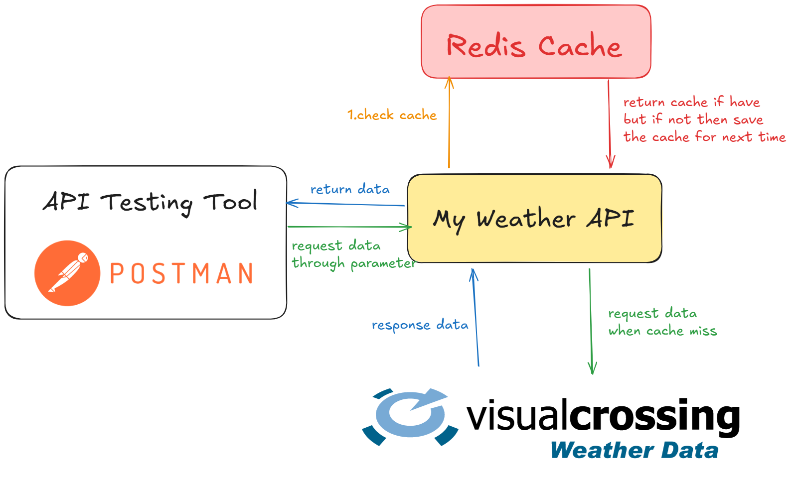

# Weather API Wrapper – TypeScript + Golang

This project is a **Weather API Wrapper Service** built with **two languages**:  
- TypeScript (Node.js + Express)  
- Golang (Gin framework)

Both services connect to the **Visual Crossing Weather API**, and use **Redis** to cache responses and improve performance. You can choose to run either version based on your preferences or use both in separate environments.

---

## Features

- External API integration with Visual Crossing
- TypeScript backend (Node.js + Express)
- Golang backend (Gin framework)
- Redis caching for faster repeated responses
- Environment variable configuration using `.env`
- Unit testing for both Go and TypeScript parts

---

## Project Structure

```
weater-application/

├── ts-part/                  # TypeScript backend (Express)
│   ├── src/
│   │   ├── controllers/
│   │   │   └── weather.controller.ts
│   │   ├── routes/
│   │   │   └── weather.route.ts
│   │   ├── services/
│   │   │   ├── cache.service.ts
│   │   │   └── weather.service.ts
│   │   └── utils/
│   │       └── env.ts
│   │
│   ├── __tests__/            # TypeScript test files
│   │   └── weather.test.ts
│   ├── .env
│   ├── app.ts
│   ├── server.ts

├── go-part/                  # Golang backend (Gin)
│   ├── controller/
│   │   └── weather_controller.go
│   ├── router/
│   │   └── weather.go
│   ├── service/
│   │   ├── cache_service.go
│   │   └── weather_service.go
│   ├── utils/
│   │   └── env.go
│   ├── tests/
│   │   └── weather_test.go
│   ├── .env
```

---

## Setup – TypeScript (ts-part)

### 1. Navigate to `ts-part`

```bash
cd ts-part
```

### 2. Install dependencies

```bash
npm install
```

### 3. Configure `.env`

Create a `.env` file with the following:

```dotenv
PORT=3000
VISUAL_CROSSING_API_KEY=your_api_key
REDIS_URL=redis://localhost:6379
CACHE_TTL=43200
```

### 4. Run the dev server

```bash
npm run dev
```

API will run on `http://localhost:3000/weather?city=Bangkok`

---

## Setup – Golang (go-part)

### 1. Navigate to `go-part`

```bash
cd go-part
```

### 2. Create a `.env` file

```dotenv
PORT=8080
REDIS_ADDR=localhost:6379
VISUAL_CROSSING_API_KEY=your_api_key
CACHE_TTL=43200
```

### 3. Start Redis (if needed)

```bash
docker run -p 6379:6379 --name redis -d redis
```

### 4. Install dependencies

```bash
go mod tidy
```

### 5. Run the server

```bash
go run main.go
```

API will be available at `http://localhost:8080/weather?city=Bangkok`

---

## Running Tests

### TypeScript:

```bash
npm run test
```

### Golang:

```bash
go test ./...
```

---

## Notes

- The app will fail to fetch weather data if no `VISUAL_CROSSING_API_KEY` is provided.
- If Redis is down, the service will still fetch from the API, but without caching.
- For production builds, set the mode to release (`gin.SetMode(gin.ReleaseMode)` for Go).

---

## License

This project is open-source and available under the MIT License.


---

## Using Postman to Test the API

You can use Postman (or any REST client) to test the endpoints.

### Example Request

**GET** request to:

```
http://localhost:3000/weather?city=Bangkok   # TypeScript
http://localhost:8080/weather?city=Bangkok   # Go
```

### Instructions:

1. Open Postman
2. Set the request method to **GET**
3. Enter the URL (based on which backend you are testing)
4. Click **Send**
5. You should see weather data in the response (if the API key is correct)

---

### Example Response

```json
{
  "resolvedAddress": "Bangkok, Thailand",
  "days": [
    {
      "datetime": "2025-04-07",
      "tempmax": 35.1,
      "tempmin": 27.0,
      "description": "Partly cloudy throughout the day.",
      ...
    }
  ]
}
```

## Architecture Diagram

Here’s an overview of how the Weather API Wrapper Service works:


